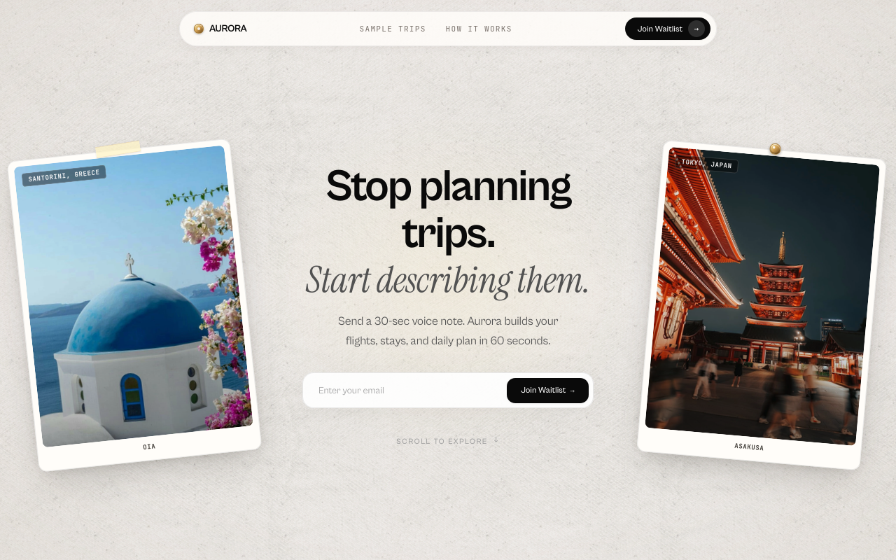
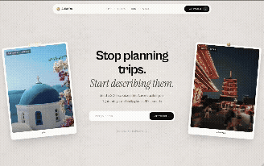
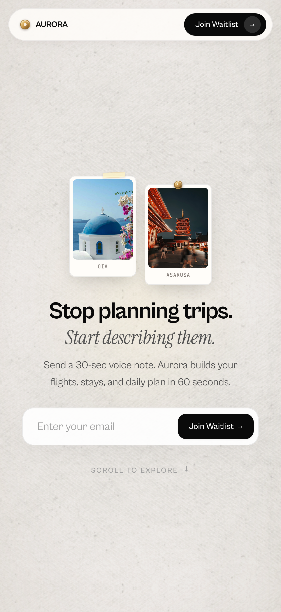

# Aurora

Aurora is a waitlist page for an imaginary travel startup. You describe a trip idea in plain words and get back flights, a stay, and a day-by-day plan. This repo holds the page, nothing more.



## What the page does

The hero shows two photo plates with Santorini on the left and Tokyo on the right, and a short dossier in the center. Scrolling fades the dossier first, then slides the plates out to the sides.

Below that, curated trips open as journey chapters. Each chapter (`TripCard.svelte`) pairs a sticky photo plate with scrolling day blocks: a scroll-spy drives the active day photo with a cross-dissolve as day blocks pass through the viewport center. Day tab pills (`01`–`04`) plus a day counter let readers jump straight to a day; manual jumps pause the spy for 2 seconds so it doesn't override the reader mid-scroll. Neighboring day photos preload so dissolves land on decoded images.

A marquee follows with press quotes and trip telemetry. Then How It Works replays the Santorini trip as a live example (voice note, matched stay, pacing, Day 1 snippet). The page ends with a closing waitlist pavilion carrying a 30-day countdown stored in localStorage, and a studio footer.

The waitlist form posts to `/api/waitlist`. It checks the address format, keeps entries in a memory set, and returns a short message for new and repeat signups. One shared `WaitlistForm.svelte` powers both the hero and the closing pavilion.

## Demo





Live URL: _add your deployment link here once it exists._

## Quickstart

Needs Bun and Node 22+.

```sh
bun install
bun run dev
```

Other commands:

```sh
bun run build
bun run preview
bun run check
bun run lint
```

## How it is built

SvelteKit 2 with Svelte 5 runes, Tailwind CSS 4 through the Vite plugin, GSAP ScrollTrigger for entrance and scrubbed exits, and Lenis for smooth wheel scroll on desktop. Touch devices use native scroll. TypeScript, ESLint, and Prettier are set up as the `sv` minimal template leaves them.

Page flow lives in `src/routes/+page.svelte`. It starts Lenis, registers ScrollTrigger, runs the entrance timeline, owns the countdown timer (skips ticks while the tab is hidden), drives the trip scroll-spy, and handles scroll-to-section plus waitlist focus. The bottom waitlist input owns `id="waitlist-email"`; nav and How It Works calls-to-action scroll down to it, while the hero keeps its own inline form.

Content lives in plain modules. `src/lib/data/trips.ts` holds the four curated trips (Santorini, Tokyo, Maldives, Swiss Alps) with voice prompts, durations, stays, flights, build latencies, and day itineraries. `src/lib/data/howItWorks.ts` derives the How It Works live example from the Santorini trip. `src/lib/data/marquee.ts` holds press and telemetry items. `src/lib/utils.ts` returns the two hero plates. `src/lib/types.ts` defines Trip, DayItinerary, FlightInfo, and related shapes. `src/lib/tripSpy.ts` is the registry linking the central scroll-spy to each chapter's active day, with a manual-click lockout.

Components map closely to sections:

- `Navbar.svelte`
- `HeroSection.svelte` with shared `WaitlistForm.svelte`
- `CuratedTripsSection.svelte` with `TripCard.svelte`
- `ProofMarquee.svelte` with `src/lib/data/marquee.ts`
- `HowItWorksSection.svelte` (live Santorini example, simulated voice-note preview, link back to the live trip above)
- `WaitlistCtaSection.svelte` with shared `WaitlistForm.svelte` (closing headline, `role="timer"` countdown)
- `Footer.svelte` (studio block: tagline, contact, cohort status, back to top)

Styling sits in `src/routes/layout.css`. Paper grain, vignette, fonts, and trip photos sit under `static/textures`, `static/fonts`, and `static/images`.

## Design notes

The background is a fixed paper tile that stays put while sections pass over it. The nav uses a frosted bar that gains a border after 15 pixels of scroll. Cards use off white fills, thin stone borders, soft shadows, and small washi tape strips. Type pairs a bold grotesque for titles with an editorial serif italic for accents and mono for labels and coordinates.

Motion stays restrained. Entrance uses short back eases. Scroll exits fade plates and minis before text so layers do not pile up. Photo changes dissolve over 450ms with a subtle settle scale, disabled under `prefers-reduced-motion`. Trigger positions refresh on window load in case late fonts or images shift layout.

## Roadmap

- Store waitlist emails in a database instead of memory
- Add rate limiting and basic spam checks to the API route
- Add Open Graph image and metadata for sharing
- Add tests for email validation and countdown logic

## Notes

Aurora is a fictional concept for portfolio use. Trips, hotels, prices, and quotes are illustrative.

<details>
<summary>Recreate with sv</summary>

```sh
bun x sv@0.17.0 create --template minimal --types ts --add prettier eslint tailwindcss="plugins:none" --install bun aurora
```

</details>
